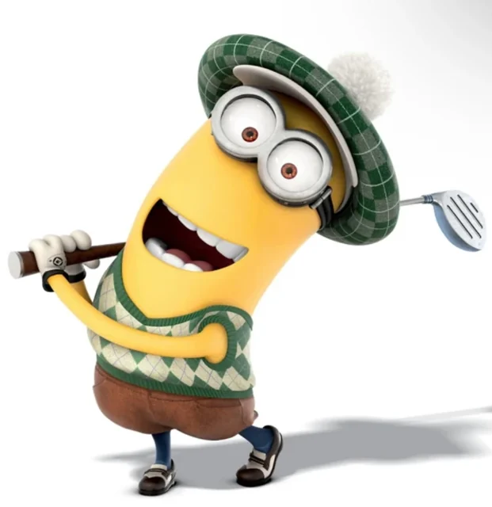

# 🍌 Miniondle

A daily **Despicable Me** Minion guessing game — Wordle, but for Minions.

Every calendar day a new mystery Minion appears at the top of the page. Study the
photo and figure out **which named Minion it is** in **5 guesses or fewer**. Each
guess shows how it compares to the answer across **Eyes**, **Height**, **Hair**, and
**Debut film** — matching traits turn 🟩 green. Solve it fast and in few guesses to
climb the **global daily leaderboard**.



## Features

- **Daily puzzle** — the same Minion for everyone each day (deterministic, date-seeded).
- **Photo at the top** — real Minion artwork sourced from the Despicable Me wiki and self-hosted.
- **5 guesses** shown as a Wordle-style grid of boxes (Eyes / Height / Hair) that
  turn green where the trait matches.
- **Smart autocomplete** — start typing and pick from the top matches; you can only
  submit a Minion that exists in the roster.
- **Win screen** with your time, guess count (X/5), and **rank on the global leaderboard**.
- **Global backend leaderboard** — real ranking across all players (won → fewer
  guesses → faster time). Gracefully falls back to an estimated rank if the server
  is unreachable.
- **Personal stats** — games played, win %, current/max streak, and guess distribution
  (stored in your browser).
- **Shareable result** (emoji grid, just like Wordle).
- Mobile-friendly, no build step, no frameworks.

## Run it

The Node server (zero dependencies) serves the game **and** the leaderboard API.

```bash
npm start          # or: node server/server.js
# open http://localhost:3000
```

That's it — no `npm install` required (only Node 18+).

## Project layout

```
index.html            # markup
styles.css            # all styling (Minion yellow + black theme)
app.js                # game logic: daily puzzle, guesses, autocomplete, stats, leaderboard
data/minions.json     # the Minion roster (name, eyes, height, hair, debut, image)
assets/minions/*.webp # self-hosted Minion photos
assets/favicon.svg
server/server.js      # static host + leaderboard API (/api/score, /api/leaderboard)
server/data/          # scores.json is created here at runtime (gitignored)
```

## Leaderboard API

| Method | Endpoint | Body / Query | Returns |
| ------ | -------- | ------------ | ------- |
| `POST` | `/api/score` | `{ puzzleId, playerId, won, guesses, timeMs }` | `{ rank, totalPlayers, percentile, distribution, winRate }` |
| `GET`  | `/api/leaderboard?puzzleId=N` | — | `{ totalPlayers, winRate, distribution, top[] }` |
| `GET`  | `/api/health` | — | `{ ok, puzzles }` |

Scores persist to `server/data/scores.json`. The store keeps each player's **best**
attempt per puzzle. For a high-traffic deployment, swap the JSON file for a database
(the `scoreValue` / `rankFor` helpers in `server/server.js` are the only ranking logic).

## Refreshing a puzzle (password protected)

There's a hidden command to reset the current day's puzzle and replay it:

- Press the secret command **`d`**, or **Ctrl/Cmd + Alt + D**, to open the password menu.
- Enter the password to wipe today's progress and start fresh.

The password is **never stored in plaintext**. The backend keeps only a salted
SHA‑256 hash and verifies the entry server-side (`POST /api/refresh-auth`), so it
can't be recovered from the source. On a static host with no backend, the same
salted-hash check runs client-side (still only the hash, never the password).

## The roster

23 named Minions across the films (Kevin, Stuart, Bob, Dave, Carl, Jerry, Tim, Mark,
Phil, Tom, Norbert, Otto, Mel, Donnie, Lance, Steve, Frankie, John, Larry, Jorge, Ed,
Paul, Ken). Traits (eyes / height / hair) were taken from each Minion's appearance
description on the [Despicable Me wiki](https://despicableme.fandom.com/wiki/Minions)
and verified against the artwork.

---

Made for fun. *Minions* and *Despicable Me* are © Universal Pictures / Illumination.
This project is a fan-made tribute and is not affiliated with or endorsed by them.
